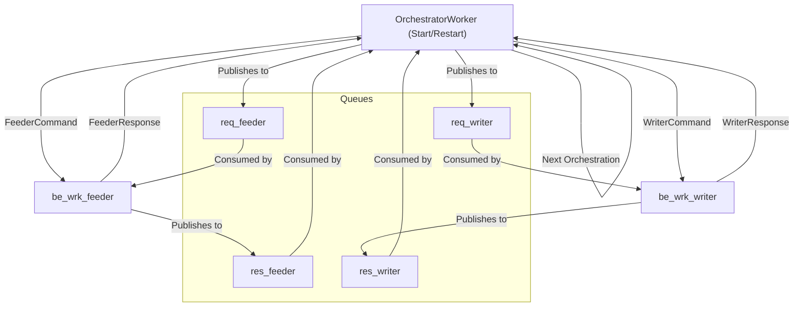

```mermaid
flowchart TD
    A["OrchestratorWorker (Start/Restart)"] -->|FeederCommand| B["be_wrk_feeder"]
    B -->|FeederResponse| A
    A -->|WriterCommand| C["be_wrk_writer"]
    C -->|WriterResponse| A
    A -->|Next Orchestration| A

    subgraph Queues
        Q1[req_feeder]
        Q2[res_feeder]
        Q3[req_writer]
        Q4[res_writer]
    end

    A -- Publishes to --> Q1
    Q1 -- Consumed by --> B
    B -- Publishes to --> Q2
    Q2 -- Consumed by --> A
    A -- Publishes to --> Q3
    Q3 -- Consumed by --> C
    C -- Publishes to --> Q4
    Q4 -- Consumed by --> A

```